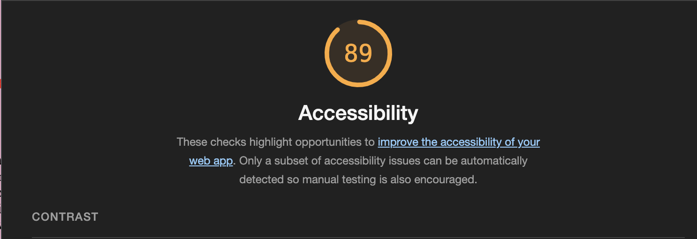

# about-me
I am making a webisite that talks about me, so users can get to know me. i have added a guessing game that utilizes HTML, CSS, & JavaScript.I include in my HTML page a short biography, my education history, an overview of my job experience, and my goals.

I created a prompt of seven questions that scores the user based on the user's input, i display the user's totaal score at the end of the quiz.

I used lighthouse chrome tool to assess the accessibility of my webpage and it had 89% accessibility.

